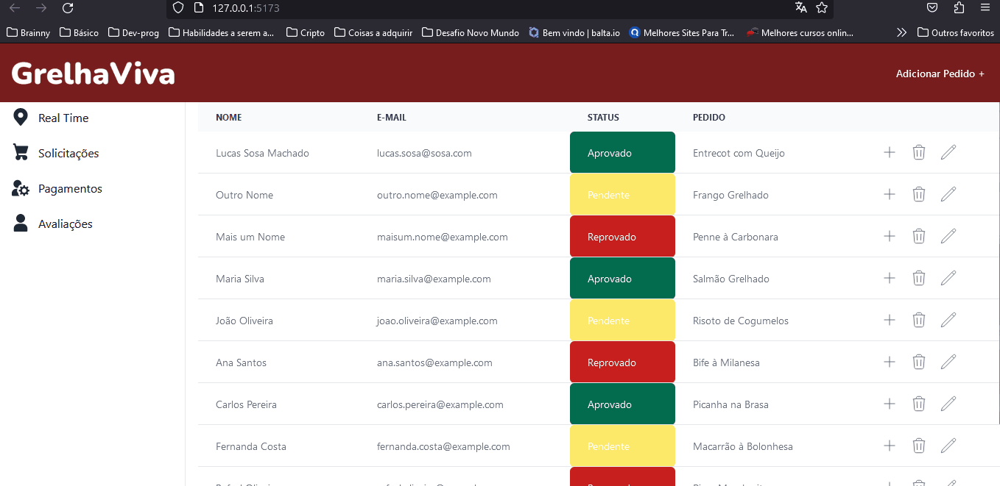

# Projeto Final Semestre 02

## Engenharia de SW
A construção desse projeto começou na cadeira de eng.sw, onde foi realizada a pesquisa. Estruturada os RF e RNF

## Programação Web
O consumo de uma api ficticia

## Desenvolvimento de web para dispositivos móveis
Foi inserido regras para o mobile

